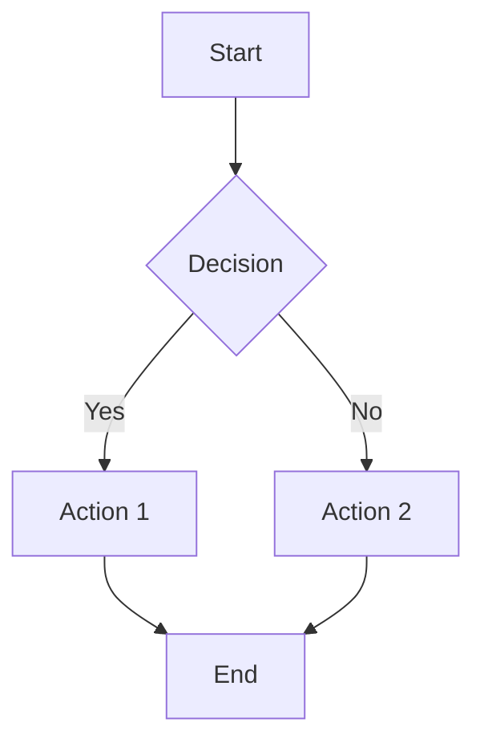
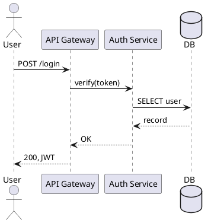
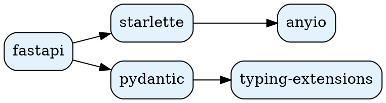

# Diagrams — схемы как код

## Tool selection

Все рекомендуемые инструменты — **text-based** (diagrams as code) — потому что они review'ятся в PR, версионируются в git, и diff'аются.

| Tool | Best for | Strength | Weakness |
|---|---|---|---|
| **Mermaid** | flowcharts, sequence, gantt, class, state, ER | Renders на GitHub/GitLab/Notion/Obsidian *нативно*. Самый широкий охват. | Ограниченный layout control |
| **D2** | архитектурные, infra | Лучший layout «из коробки», красивый дефолт | Меньше LLM-знакомства, отдельный CLI |
| **PlantUML** | UML (class, sequence, activity, use case) | Глубочайший UML support | Java-зависимость, dated стиль |
| **Graphviz / DOT** | большие графы, dependency trees | Мощный layout engine (dot/neato/fdp) | Старый стиль, steep curve |
| **Excalidraw** | sketches, brainstorm, whiteboard | Hand-drawn look, real-time коллаб (E2E encrypted), zero sign-up | JSON-source менее читаемый |
| **diagrams.py** | AWS/GCP/Azure/K8s архитектуры с правильными иконками | Готовые official cloud icons | Только для cloud topology |

**Default choice**: для GitHub README / docs / quick flowchart — **Mermaid**. Для архитектурного pdf-output — **D2** или **diagrams.py**.

## Quick decision tree

```
Это для GitHub/GitLab/Notion README?              → Mermaid
Это AWS/GCP/Azure/K8s топология с иконками?       → diagrams.py
Это требует idealized layout без подгонки?         → D2
Это формальная UML (class + sequence + activity)? → PlantUML
Это sketch / brainstorm на встрече?                → Excalidraw
Это огромный dep-граф (>100 узлов)?                → Graphviz (dot/neato)
```

## Mermaid (стандарт-де-факто)

Рендерится в любом markdown viewer'е GitHub/GitLab. Просто вставь в код-fence:

````markdown

````

### Flowchart
```
graph TD
  A[Input] --> B[Tokenize]
  B --> C{Length > 1024?}
  C -->|yes| D[Truncate]
  C -->|no| E[Pad]
  D --> F[Model]
  E --> F
  F --> G[Output]
```
`TD`=top-down, `LR`=left-right, `BT`/`RL` тоже.

### Sequence diagram
```
sequenceDiagram
  participant U as User
  participant A as API
  participant DB as Database
  U->>A: POST /train
  A->>DB: INSERT job
  DB-->>A: job_id
  A-->>U: {"job_id": 42}
  Note over A: запуск в фоне
  A->>DB: UPDATE status="running"
```

### State diagram
```
stateDiagram-v2
  [*] --> Idle
  Idle --> Loading: start
  Loading --> Ready: success
  Loading --> Error: fail
  Ready --> Idle: reset
  Error --> Idle: retry
```

### ER diagram
```
erDiagram
  USER ||--o{ ORDER : places
  ORDER ||--|{ LINE_ITEM : contains
  USER {
    int id PK
    string email
  }
  ORDER {
    int id PK
    int user_id FK
    datetime created_at
  }
```

### Class diagram (короткий UML)
```
classDiagram
  class Model {
    +int n_params
    +forward(x) Tensor
  }
  class Transformer {
    +int n_layers
    +int d_model
  }
  Model <|-- Transformer
```

### Gantt
```
gantt
  title Project timeline
  dateFormat YYYY-MM-DD
  section Phase 1
  Design     :a1, 2026-05-01, 7d
  Prototype  :after a1, 14d
  section Phase 2
  Eval       :2026-05-22, 10d
```

### Стилизация Mermaid
```
graph LR
  A[Input]:::important --> B[Output]
  classDef important fill:#f96,stroke:#333,stroke-width:2px
```

## D2 (когда нужен красивый layout)

```d2
# saved as architecture.d2
user -> api: HTTP
api -> redis: cache
api -> postgres: persist
api -> queue: enqueue job
queue -> worker

worker.shape: hexagon
postgres.shape: cylinder
redis.shape: cylinder
```

Render: `d2 architecture.d2 architecture.svg` (или `.pdf`).

D2 daemon: `d2 -w architecture.d2 architecture.svg` — auto-rebuild при изменениях.

## PlantUML (формальная UML)



Render: `plantuml diagram.puml` → `diagram.png`.

Strength: только PlantUML делает activity diagrams хорошо.

## diagrams.py (cloud architectures)

`pip install diagrams` (требует Graphviz: `apt install graphviz`).

```python
from diagrams import Diagram, Cluster
from diagrams.aws.compute import EC2
from diagrams.aws.network import ELB
from diagrams.aws.database import RDS

with Diagram("Web Architecture", show=False, filename="arch", outformat="pdf"):
    lb = ELB("ALB")
    with Cluster("App layer"):
        web = [EC2("web1"), EC2("web2"), EC2("web3")]
    db = RDS("postgres")
    lb >> web >> db
```

Иконки также для GCP, Azure, Kubernetes, OnPrem (`from diagrams.k8s.compute import Pod`, etc.).

## Excalidraw (sketches / коллаб)

Не code-first, но JSON-source — diff-friendly. Лучший вариант когда:
- Brainstorming на встрече с коллегами (real-time collab, E2E encrypted)
- Sketch-style для презентации (выглядит как «я нарисовал на доске»)
- Hand-drawn look для README

`https://excalidraw.com` → "Save to Disk" → `.excalidraw` (JSON). Можно версионировать в git.

## Graphviz (большие графы)

Когда у тебя 100+ узлов и автомат-layout критичен:



Render: `dot -Tpdf deps.dot -o deps.pdf` (или `neato`, `fdp`, `circo`, `twopi` для разных layout'ов).

## Design principles для диаграмм

### 1. Один тип на диаграмму
Не смешивай sequence + flowchart + class в одной картинке. Лучше 3 фокусных диаграммы чем одна нечитаемая.

### 2. Maximum 12 узлов на одной диаграмме
Если больше — разбить на sub-diagrams или использовать D2/Graphviz с clustering.

### 3. Подписать рёбра
В sequence: `A->>B: HTTP POST /users` — что происходит. Без подписи рёбра — мусор.

### 4. Direction matters
- Flowchart процесса — TD (top-down), потому что время идёт вниз
- Архитектура (request flow) — LR (left-to-right)
- Зависимости — LR с лидерами слева

### 5. Цвета — для семантики
- Красный = критичный/error path
- Зелёный = success path  
- Жёлтый = warning/deprecated
- Серый = optional/future
- Не используй >5 цветов на диаграмме.

### 6. Legend если нужен
Если используешь shape'ы и цвета как coding — добавь legend node.

### 7. Single source of truth
Если диаграмма про систему — не редактируй её одновременно в Mermaid и в Excalidraw. Один формат, в одном месте, версионирование.

## Workflow для paper / технического отчёта

```bash
# Mermaid → PDF (через mmdc CLI)
npm install -g @mermaid-js/mermaid-cli
mmdc -i diagram.mmd -o diagram.pdf -w 1200

# D2 → PDF
brew install d2  # or scoop / apt
d2 architecture.d2 architecture.pdf

# PlantUML → PDF
plantuml -tpdf diagram.puml

# diagrams.py → PDF
python arch.py  # с outformat="pdf"
```

Все они дают **vector PDF** — масштабируется без потерь, можно вставить в LaTeX:
```latex
\includegraphics[width=\linewidth]{figures/architecture.pdf}
```

## Common gotchas

| Проблема | Решение |
|---|---|
| Mermaid не рендерится в GitHub | проверь fence `:::mermaid` правильно `mermaid` (lowercase) |
| Длинные labels накладываются | укоротить или использовать `<br/>` для multiline |
| diagrams.py "graphviz not found" | `apt install graphviz` или `brew install graphviz` |
| PlantUML выдаёт hello-world picture | пропустил `@startuml`/`@enduml` |
| Diagram не помещается на slide | переделать на TB→LR layout, или разбить |
| Кириллица в Mermaid не работает | работает в большинстве рендереров; если нет — escape unicode |

## Hard rules

- **Никогда не вставляй PNG скриншот диаграммы** в paper/README — vector source + render to PDF.
- **Всегда версионируй .mmd / .d2 / .puml / .py / .dot** — диаграмма должна reproduce'иться.
- **Никогда не редактируй уже finalized diagram через GUI** — сломаешь diff.
- **Один тип диаграммы** на одну image (не смешивай).
- **Max 12 узлов** на одной диаграмме.
- **Подписывать все рёбра** в sequence/flow.
- **Vector format** для финальных export'ов (PDF/SVG, не PNG).

## Sources

- Best diagram tools 2026 comparison: https://nimbalyst.com/blog/best-ai-diagram-tools-2026/
- Text-to-diagram detailed comparison: https://text-to-diagram.com/
- Mermaid vs PlantUML: https://www.gleek.io/blog/mermaid-vs-plantuml
- Mermaid vs D2: https://aaronjbecker.com/posts/mermaid-vs-d2-comparing-text-to-diagram-tools/
- Technical diagrams (Mermaid, PlantUML, Excalidraw): https://dasroot.net/posts/2026/04/creating-technical-diagrams-mermaid-plantuml-excalidraw/
- D2 FAQ: https://d2lang.com/tour/faq/

## Связанные skills

- **`latex-writing`** — для вставки рендеренных PDF в .tex.
- **`data-viz`** — для графиков данных (а не схем).
- **`writing-plans`** — для проектных планов (часто содержат диаграммы).
